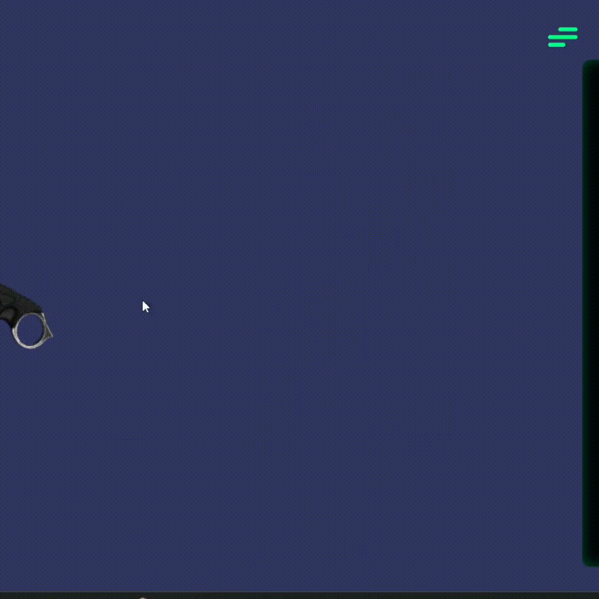
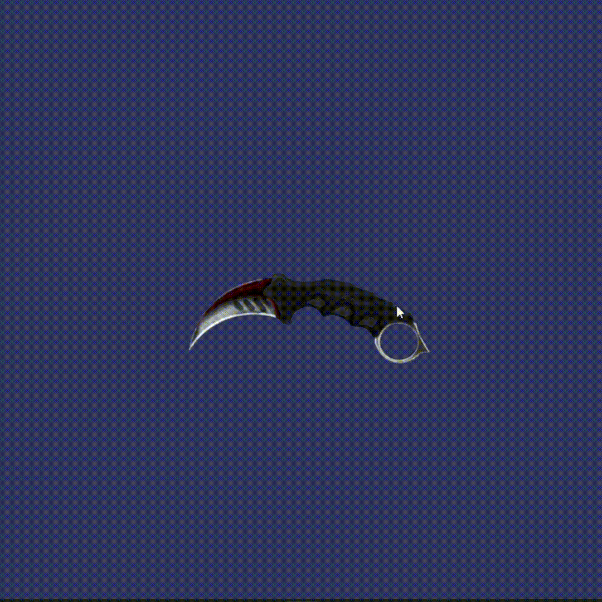

<div align="center">

# 🌐 3D Viewer — Custom Autorotation


<a href="https://unapinyamas.github.io/3D-Viewer-Custom-Autorotation/">
  
</a>

<br/>

🇪🇸 [Leer en Español](README.es.md)

<br/>

> Interactive 3D viewer in the browser with real-time customizable scene controls. Load any **GLTF/GLB** model and explore it with automatic rotation, dynamic lighting, and more.

</div
  
  >---

## 🎬 Demo

<div align="center">




</div>

---rotation, dynamic lighting, and more.

</div>

---

## ✨ Features

- 🎮 **Interactive 3D model** — Load and render any GLTF/GLB model
- 🔄 **Customizable autorotation** — Toggle automatic rotation and adjust its speed
- 🖱️ **OrbitControls** — Rotate, zoom and pan the model freely with your mouse
- 💡 **Dynamic lighting** — Control color and intensity of ambient and directional lights
- 🎨 **Custom background** — Change the scene background color in real time
- 🔍 **Zoom control** — Adjust zoom level with a slider
- 📱 **Responsive** — Automatically adapts to any window size
- 🍔 **Animated side menu** — Elegant hamburger menu panel with all options

---

## 🗂️ Project Structure

```
3D-Viewer-Custom-Autorotation/
│
├── 📄 index.html        # Main HTML structure + scene options menu
├── 📜 script.js         # Three.js logic: scene, camera, lights & controls
├── 🎨 styles.css        # Viewer and side menu styles
└── 📁 assets/
    └── (GLTF/GLB models go here)
```

---

## 🚀 Installation & Usage

### 1. Clone the repository

```bash
git clone https://github.com/UnaPinyaMas/3D-Viewer-Custom-Autorotation.git
cd 3D-Viewer-Custom-Autorotation
```

### 2. Start a local server

> ⚠️ GLTF models require an HTTP server. Do **not** open `index.html` directly from the file explorer.

**With VS Code (Live Server):**
```
Install the "Live Server" extension → click "Go Live"
```

**With Python:**
```bash
python -m http.server 8080
```

**With Node.js:**
```bash
npx serve .
```

### 3. Open in your browser

```
http://localhost:8080
```

---

## 🎛️ Controls Panel

Click the **hamburger button** (☰) to open the side panel:

| Control | Description |
|---|---|
| 🎨 **Background color** | Change the scene background color |
| 💡 **Ambient Light** | Adjust color and intensity of global lighting |
| 🔦 **Directional Light** | Adjust color and intensity of directional light |
| 🔍 **Zoom** | Control the camera zoom level |
| 🔄 **Auto Rotation** | Toggle automatic rotation on/off |
| ⚡ **Rotation Speed** | Adjust the speed of the automatic rotation |

---

## 🛠️ Tech Stack

| Technology | Version | Purpose |
|---|---|---|
| [Three.js](https://threejs.org/) | v0.146.0 | WebGL 3D rendering engine |
| **GLTFLoader** | v0.146.0 | Load 3D models in `.gltf` / `.glb` format |
| **OrbitControls** | v0.146.0 | Mouse-based camera control |
| **HTML5 / CSS3** | — | UI and styling |
| **JavaScript ES6** | — | Application logic |

---

## 🔄 Use Your Own 3D Model

Place your GLTF/GLB model inside the `assets/` folder and update the path in `script.js`:

```javascript
loader.load(
  'assets/your-model/scene.gltf', // 👈 Change this path
  function (gltf) { ... }
);
```

The camera will **automatically** position itself based on the model's bounding box.

---

## ⚙️ How It Works

```
1. Three.js scene initializes with WebGLRenderer (antialiasing enabled)
2. Lights are added: ambient + directional, both fully configurable
3. GLTFLoader loads the 3D model from the specified path
4. Camera auto-positions using the model's BoundingBox
5. OrbitControls enables interaction (rotate, zoom, pan) with smooth damping
6. Animation loop (requestAnimationFrame) updates and renders every frame
7. Side menu event listeners modify the scene in real time
```

---

<div align="center">

Made by **Piña** 🍍

</div>


